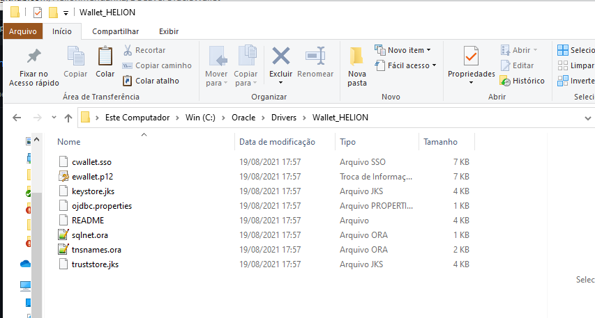
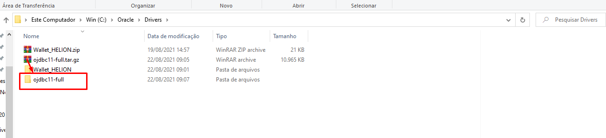

# Conectando o DBeaver ao Oracle com Wallet

## Baixe a sua Wallet e descompacte

- Baixe a sua Wallet e salve em algum local de sua preferência
<h1 align="center">
  
</h1>

- Descompacte a sua Wallet
<h1 align="center">
  
</h1>

## Baixe o driver JDBC (ojdbc11-full.tar.gz) diretamente do site da Oracle

- Link para download do driver na data deste post [(ojdbc11-full.tar.gz)](https://www.oracle.com/database/technologies/appdev/jdbc-ucp-21-1-c-downloads.html)
<h1 align="center">
  
</h1>

- Escolha um local e descompacte o arquivo contendo os drivers
<h1 align="center">
  
</h1>